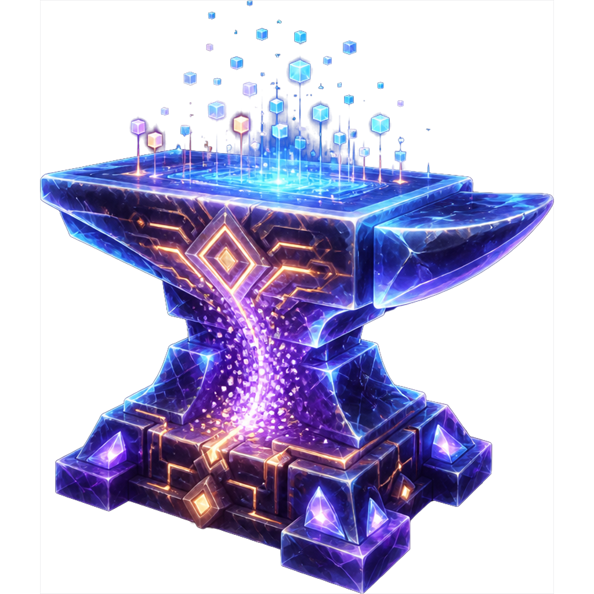

# Project: Anvilon | [代号：砧子](./README.md)

[][AnvilCraft]
[][AnvilLib]

### License

[][License]

### Asset License

[][Asset License]

[][GitHub CI]
[][Github Releases]

[AnvilCraft]: https://www.anvilcraft.dev

[AnvilLib]: https://lib.anvilcraft.dev

[GitHub CI]: https://github.com/Anvil-Dev/AnvilCraft/actions/workflows/ci.yml

[Github Releases]: https://github.com/Anvil-Dev/AnvilCraft/releases

[License]: https://spdx.org/licenses/LGPL-3.0-only.html

[Asset License]: https://gist.github.com/Gu-ZT/38961ed5c97500cf61b04ab048fa38ad

## About

The world is woven from fundamental particles called **Anvilon**, whose arrangement shapes the reality we perceive.

With the **Anvilon Recompiler**, you can run the **Anvilon Recompile Protocol** — a set of recorded computation steps —
to reorganize Anvilon particles, rewriting reality to achieve effects beyond the ordinary.

Fragments of the Anvilon Recompile Protocol lie scattered across the world, each recording the specific steps for
modifying reality's display. Collect, decipher, and recompile them to rewrite the rules of the world itself.

## License

* Code unless otherwise stated default to our [LICENSE file (LGPL-3.0)](./LICENSE) here
* Non-Code assets (Located here) go by our [ASSET_LICENSE file (ARR)](./ASSETS_LICENSE) here

## Usage

Download the corresponding version of AnvilCraftMod and place it in the `mods` folder to start the game.

## Maintainer

[@Gugle](https://github.com/Gu-ZT)

## Mascot

[@Argon4W](https://github.com/Argon4W)
